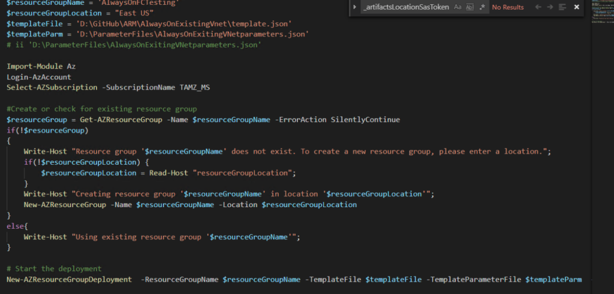
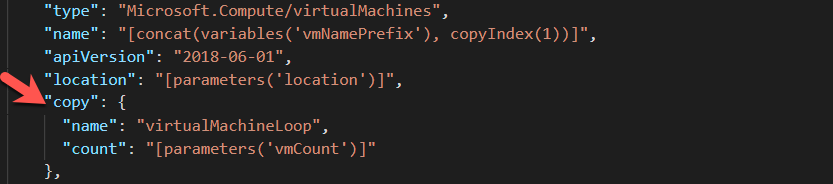
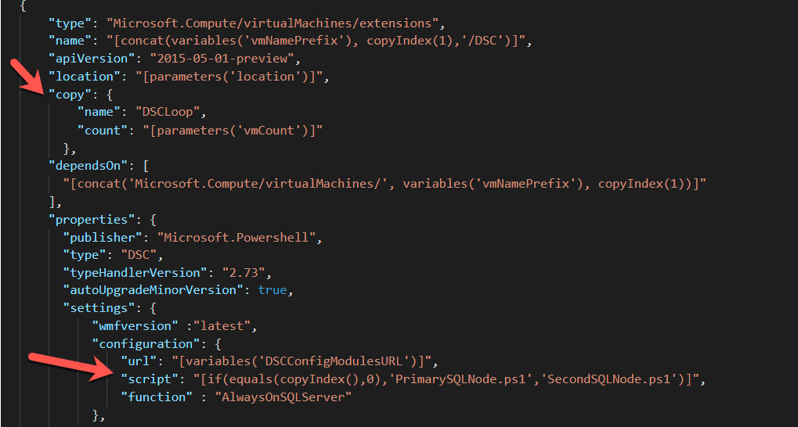

# Automating SQL Server In Azure with Azure Resource Manager(ARM) Part 2

1/3/2019

Continuing where we left off from our last post, we are now going to look into a more complex Azure Resource Manager (ARM) template. In this post we will cover an Always On deployment to an existing VNet and domain.

Provided you read the first post in this series, you will have a copy of my Github ARM repo local to your machine. If not, head over to Github and download or fork a copy from [here](https://github.com/aultt/ARM).

Now that we have a copy to work with locally, let’s take a look at the files we have to work with. Things should look very similar to the standalone files. We have three files and a folder just as we did before:

template.json : ARM Template which describes what will be deployed.
paramaters.json : Parameter file passed to ARM template with variables defined for deployment
DSC Folder : DSC configurations applied to SQL Servers at build time
deploy.ps1 : PowerShell script to aid in deploying the template
Again, we will start with the deploy.ps1 file.
You will quickly see this looks just like the standalone template with the exception of the variables values. We won’t go into the specifics of the contents of this file. If you would like a detailed walk through, then please reference the first post in this series.

parameters.json will look similar to the standalone template, however, we now have many additional variables which we must pass. Below is a list of the variables and their description:

- location : region where machines will be deployed
- namePrefix: Prefix which will be used for naming resources. Virtual machines will have a numeric number appended.
- vmCount: number of vm’s to create. (Valid values: 2-8)
- virtualMachineSize : Azure machine size of the VM to create.
- existingVirtualNetworkRGName: Resource Group Name where VNet is created.
- existingVirtualNetworkName: Name of the VNet which you are deploying to.
- existingSubnet: Name of the subnet you are deploying to.
- domainName: Name of your domain fully qualified. (Ex. tamz.us)
- adminUsername: local administrator account for windows
- adminPassword: KeVault reference to local admin password.
- networkSecurityGroupName: Name of the network security group which is created.
- availabilitySetName: Name of Availability Set which is created for all VMs to reside in.
- ClusterStaticIP: Static IP address assigned to the cluster. There is confusion often around this as Azure has no way to assign static ip addresses. In this case you will grab an ip address within your VNet, when the load balancer is created behind the scenes Azure will reserve the IP address for you making it static.
- ClusterIPSubnetClass: Subnet Class for the ClusterIp. (For a /24 provide 24 for a /16 provide 16)
availabilityGroupName: Name of the availability group to be created.
- sqlPort : Port SQL Server will be listening on
- listenerStaticIP: Static IP address for AvailabilityGroup Listener.
- listenerSubnetMask: Subnet Mask for availability Group
- diagnosticStorageAccountName: Name of the diagnosticStorageAccount where you would like to store diagnostics
- diagnosticStorageAccountId: Id of the Storage account. (This can be found by clicking properties on the storage account)
- sqlAuthenticationLogin: SQL account which will be made the sa.
- sqlAuthenticationPassword: KeVault reference to the sa password.
- sqlSysAdmins: Windows domain group which you would like to have sysadmin role.
- domainUsername: Domain user with the ability to add computers to the domain and the ability to create computer accounts, such as Cluster and Availability Group listener.
- sqlUserName: User account which will be running SQL Server Service
- sqlUserPassword: KeVault reference to the password for the SQL Service account
- _artifactsLocation: location of artifacts. If you don’t make any changes to the DSC template this can be left to point to my Github. If you need to make changes this allows you to point it to another location.

As you can see, we have have many additional parameters we need to provide for an AlwaysOn template. Keep in mind these are just the required parameters, there are many other parameters you could choose to pass if you need to deviate from one of the values I have defaulted.

Let’s now move on and look at template.json. template.json holds the additional parameters we could pass as well as all of the different resources which will be created with our template. Take a look at the parameters block. We have virtually every item here which can be passed as a parameter. If you find something that is not parameterized feel free to submit a pull request with it, or raise an issue and we will look to add it. Take a moment to look through all the parameters and familiarize yourself with what’s available.

Moving down the document, the next notable resource I want to cover is availabilitySets. A quick definition of an availability set is provided below:

An Availability Set is a logical grouping capability that you can use in Azure to ensure that the VM resources you place within it are isolated from each other when they are deployed within an Azure datacenter. Azure ensures that the VMs you place within an Availability Set run across multiple physical servers, compute racks, storage units, and network switches. If a hardware or Azure software failure occurs, only a subset of your VMs are impacted, and your overall application stays up and continues to be available to your customers. Availability Sets are an essential capability when you want to build reliable cloud solutions. https://docs.microsoft.com/en-us/azure/virtual-machines/windows/tutorial-availability-sets

Storage Account is the next resource which is defined. We provision a storage account to utilize as a Cloud Witness for our Windows Cluster.

Virtual Machines is our next resource. I’d like to point out here an important feature within the json document. Notice the copy item, this is how we create from 2 – 8 different virtual machines depending on the vmCount which you pass. All machines are built alike and the template just creates a loop which it executes till the vmCount is reached.

You will notice as you look through the virtual Machines section, the disks which are created and the size and type of disk are parameters which can be passed.

Extensions resource follows our virtual Machines. Extensions are where are DSC Configurations are defined. Below I have highlighted the interesting points for the DSC Extension.

Note again we leverage the copy loop to loop through each VM created and apply the DSC Configuration. The difference here lies in the script for the configuration. We want to apply a different script for the first Node in the cluster than the remaining nodes. Why? Because initially we have to create the Windows Cluster, and we need to Create the Availability Group. We only do this once, on all other nodes we will do a join instead of a create. We will talk more through this when we get to the DSC configuration. Just note here we call PrimarySQLNode configuration for the first node and all other nodes will get SecondSQLNode applied.

Following our extensions we have our network Interfaces and our load balancer. If you haven’t done any Azure deployments of Always On, you may be saying load balancer – why? Below is a picture which depicts how the Internal Load balancer is being utilized. The key difference for an Availability Group in Azure Virtual Machines is that the Azure virtual machines, require a load balancer. The load balancer holds the IP addresses for the availability group listener. If you have more than one availability group, then each group requires a listener. One load balancer can support multiple listeners.

We have now gone through all of the resources with the template.json file. The final thing to review are the two DSC Configurations included within the DSC folder. The two files are virtually identical with the difference being the secondary does a Join to the cluster and Availability Group as opposed to creating them. In addition, the secondary waits for Cluster and Availability Group to exist before it attempts to join and continue. Doing so allows for many items within the configuration to be completed in parallel ultimately saving build time.

Opening up PrimarySQLNode.ps1 and walk through the file. As you walk through the file, look below as I will list out all the items which are set by the configuration:

- Create a Firewall rule for the SQL Probe on the load balancer to communicate.
- Create a Firewall run for the Cluster Probe on the load balancer to communicate.
- Series of Disk configurations waiting for disks to be available then creating the volume and formatting the volume 64kb for SQL.
- Install Failover Cluster Role on server
- Install FailoverCluster tools
- Install PowerShell tools for clustering.Installs Active Directory PowerShell tools
- Join machine to the domain
- Create windows cluster
- Add Probe to the cluster resource to allow it to monitor the state of the cluster.
- Set Cluster Quorum to Cloud Majority Node set.
- Set PowerPlan to High Performance
- Set TimeZone : EST by default
- Install SQL Server
- Assign PerformVolumeMaintenance Tasks to SQL Server Account
- Assign Lock Pages in Memory to SQL Server Account
- Set MaxDop based on number of cores allocated
- Set Max Memory based on memory allocated to machine
- Create Firewall rule for SQL Server
- Create login for Cluster Service
- Add permissions to Cluster Service to allow it to manage availability groups
- Create Endpoint for AlwaysOn
- Enable Always ON Feature for SQL Server
- Create SQL Availability Group
- Create SQL Availability Group Listener
- Add Probe to SQL Cluster Resource

Notice the same items are set for each instance of SQL Server. Here the differences are all of the additional configuration required for clustering. I’ll note here, the other file stored within the DSC directory is Cluster.ps1.zip. Within the zip file are all the different DSC resources which are required to deploy the configuration. I’ll note here as well, StorageDsc and xFailoverCluster both have modifications from what is available in GitHub today. The changes were required for the resources to work within Azure.

We have now walked through all of the resources required to deploy an AlwaysOn Cluster in Azure. As before, I’ll note in my testing that I have tested a two node cluster and an eight node cluster. Two nodes took a total of 30 minutes to complete while the eight node cluster took 40 min in total. All and all thats pretty darn quick to build out a cluster. As always feel free to comment here or on my GitHub. Happy Automating!