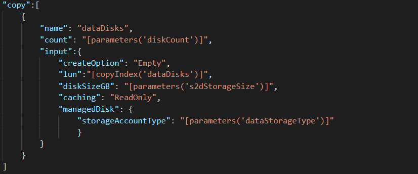
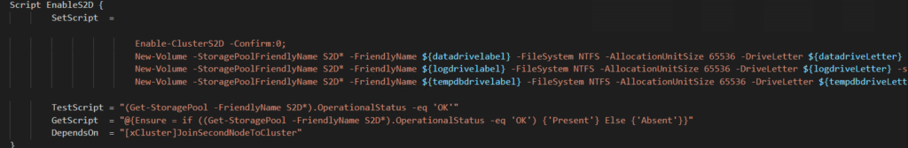

# Automating SQL Server In Azure with Azure Resource Manager(ARM) Part 3

1/15/2019

Finishing out the series on SQL Server Automation for IaaS. The final template is SQL Server Failover Cluster Instance running on storage spaces direct.

Source code for this and all other templates can be found on my Github. For this template the direct link is [here](https://github.com/aultt/ARM/tree/master/FCIS2DExistingVnet).

Ensure you have read through the first two posts in this series, as in each one I discuss the differences but not in as much detail if it has been covered previously.

Across all three templates the same files exist:

template.json : ARM Template which describes what will be deployed.
parameters.json : Parameter file passed to ARM template with variables defined for deployment
DSC Folder : DSC configurations applied to SQL Servers at build time
deploy.ps1 : PowerShell script to aid in deploying the template
Deploy file looks the same as both the previous with the exception subscription was added as a parameter.

Below you will see a list of the parameters required to be updated/verified in the parameters.json file:

location : region where machines will be deployed
namePrefix: Prefix which will be used for naming resources. Virtual machines will have a numeric number appended.
virtualMachineSize : Azure machine size of the VM to create.
existingVirtualNetworkRGName: Resource Group Name where VNet is created.
existingVirtualNetworkName: Name of the VNet which you are deploying to.
existingSubnet: Name of the subnet you are deploying to.
domainName: Name of your domain fully qualified. (Ex. tamz.us)
adminUsername: local administrator account for windows
adminPassword: KeVault reference to local admin password.
networkSecurityGroupName: Name of the network security group which is created.
availabilitySetName: Name of Availability Set which is created for all VMs to reside in.
ClusterStaticIP: Static IP address assigned to the cluster. There is often confusion around this as Azure has no way to assign static ip addresses. In this case, you will grab an ip address within your VNet, when the load balancer is created then behind the scenes Azure will reserve the IP address for you making it static.
ClusterIPSubnetClass: Subnet Class for the ClusterIp. (For a /24 provide 24 for a /16 provide 16)
ClusterIPSubnetMask: Subnet mask for the ClusterIP. (for a /24 255.255.255.0)
logdrivesize: Size of the log partition which will be created on the Storage Spaces Direct Volume.
datadrivesize: Size of the data partition which will be created on the Storage Spaces Direct Volume.
tempdbdrivesize: Size of the tempdb partition which will be created on the Storage Spaces Direct Volume.
sqlClusterName: SQL Network name for the FCI
sqlPort : Port SQL Server will be listening on
sqlStaticIP: Static IP address assigned to the SQL NetworkName.
diagnosticStorageAccountName: Name of the diagnosticStorageAccount where you would like to store diagnostics
diagnosticStorageAccountId: Id of the Storage account. (This can be found by clicking properties on the storage account)
sqlAuthenticationLogin: SQL account which will be made the sa.
sqlAuthenticationPassword: KeVault reference to the sa password.
sqlSysAdmins: Windows domain group which you would like to have sysadmin role.
domainUsername: Domain user with the ability to add computers to the domain and the ability to create computer accounts, such as Cluster and Availability Group listener.
sqlUserName: User account which will be running SQL Server Service
sqlUserPassword: KeyVault reference to the password for the SQL Service account
agtUserName: User Account which will be running SQL Server Agent Service account
agtUserPassword: KeyVault reference to the password for the SQL Service Agent account
_artifactsLocation: location of artifacts. If you don’t make any changes to the DSC template, then this can be left to point to my Github. If you need to make changes, then this allows you to point it to another location.
After looking through the parameters you will find a a few additional, which you would expect if you have installed a SQL Failover Cluster in the past.

Taking a look at the template.json file, we will find everything is pretty much the same with one exception. Storage spaces direct requires a minimum of two disks per server. With storage spaces direct, we are also limited to one storage volume per cluster. With this being the case, we need to have the ability to pool disks to ensure we meet our performance requirement. Below you will see the json which creates the disks required for the pool. Notice you have the flexibility to specify the number size and type of storage used.

The remainder of the tempate.json file is identical or nearly identical to AlwaysOn.

So where does the difference really reside you ask? The majority of the differences fall in the DSC templates. Storage spaces direct requires all nodes and disks are present before enabling and creating the pool. This in turn means there is less room for parallel tasks. Without parallel task, our time to build the cluster is longer. This is only relevant at time of build but worth noting. For comparison, a two node AlwaysOn cluster with previous template took about 30 min in my tests while the two node FCI cluster took slightly over an hour. So let’s walk through the primary configuration first then we will walk through the secondary.

Looking at PrimarySQLNode.ps1, everything will look the same until just prior to the SQL Server Installation. You will see a new script component labeled SQLClusterConnectivity. Ultimately, this is leveraging Invoke-sqlcmd to verify if a connection can be made to the SQL Cluster Network Name. If it cannot, then it sleeps and attempts again until retrycount is exceeded. You may ask yourself “but I haven’t installed SQL yet, how does SQL Exist?” This is the big change with FCI. To install SQL, we must have the cluster created and we must have a shared disk to install SQL on. Before we can create the storage volume, we must have a cluster with all nodes and disks present. So… what happens is PrimarySQLNode.ps1 adds the server to the domain, installs all the windows features required, creates the cluster, and configures any non cluster specific parameters on the server. At that time it will wait until SecondarySQLNode has essentially completed its tasks. The final outcome of SecondarySQLNode is SQL Server running on a single node of the cluster. Once PrimarySQLNode finds this running it will continue on and AddNode to SQL Cluster completing the configuration.

Finally, we will look at SecondarySQLNode.ps1. The first half of the configuration is identical to the AlwaysOn configuration. Differences begin after the node is added to the cluster.

Here we see a script resource EnableS2D which enables storage spaces direct on the cluster and creates the three partitions required for data, log and tempdb. After the storage pool and partitions are created, SQL Server can be installed and configured. The final step required is adding the load balancer probe to the SQL Cluster Resource which enables connectivity to the SQL Instance from other machines.

Hopefully these ARM templates will aid customers in their journey to the cloud. Happy automating!

