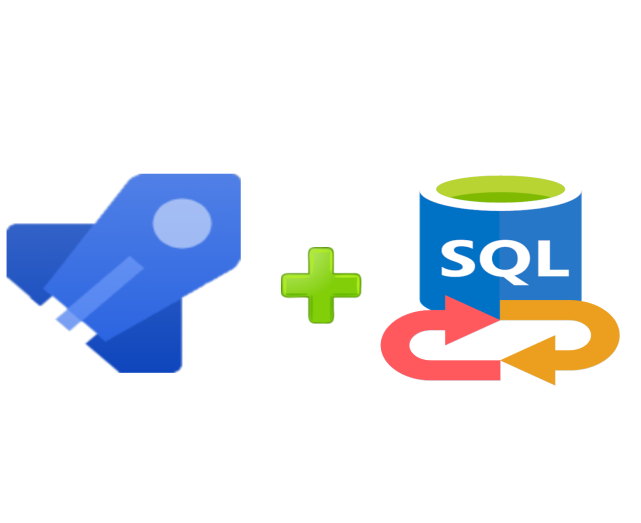
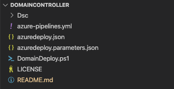
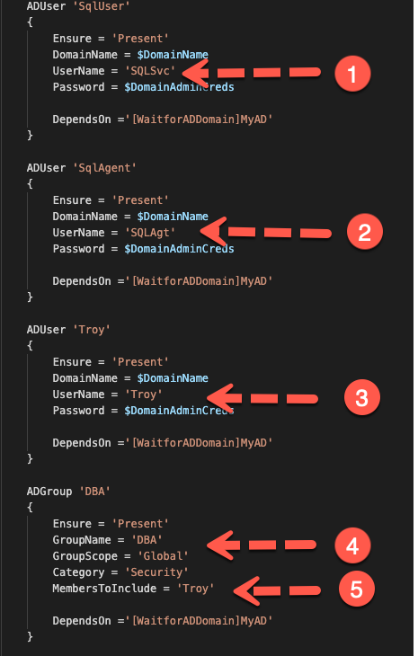
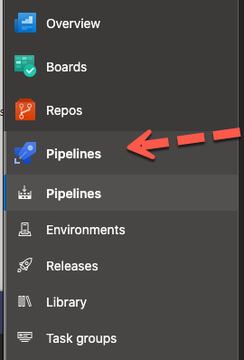
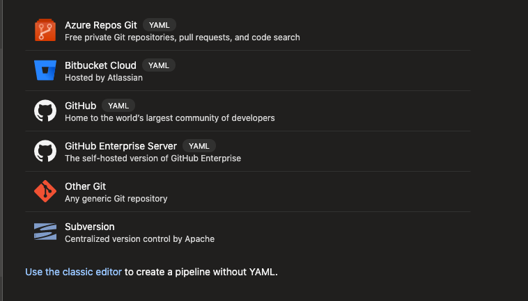
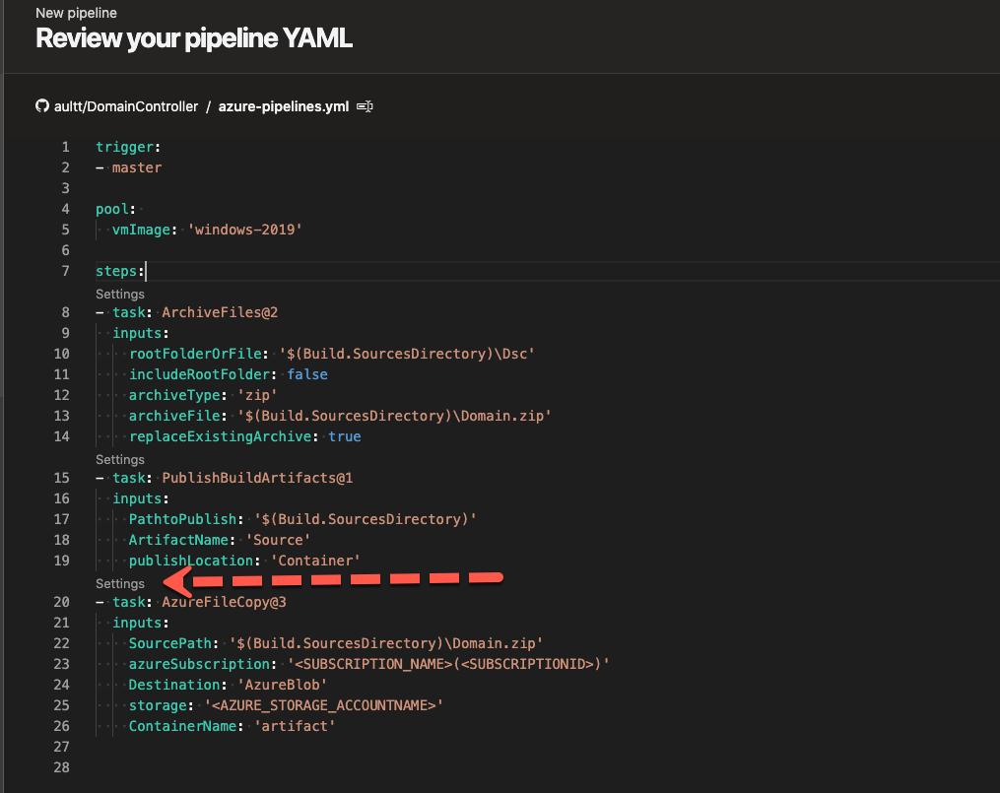
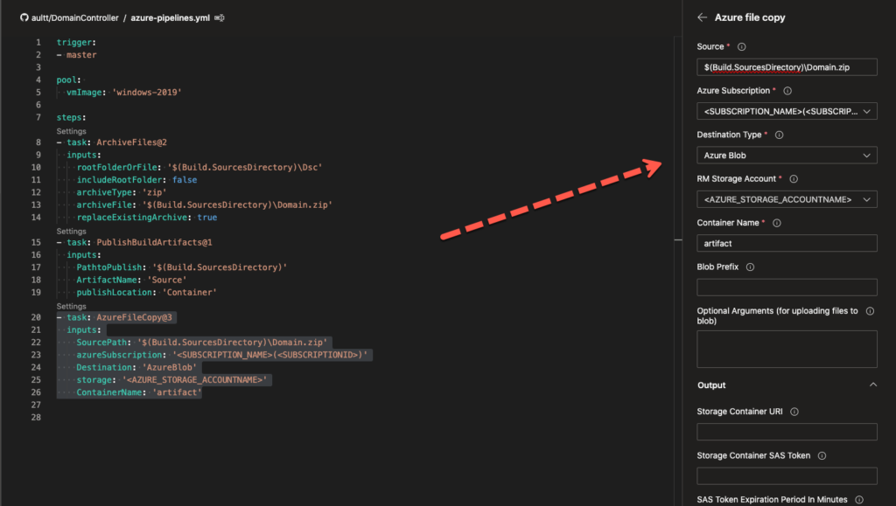
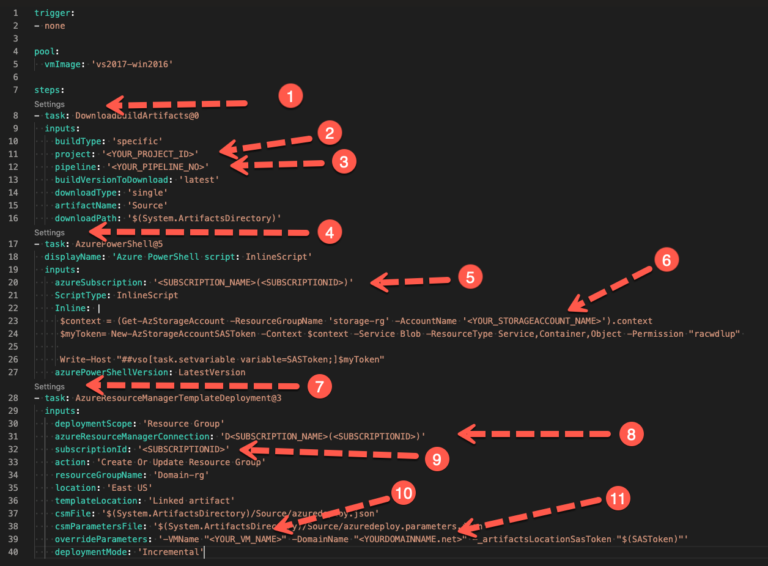
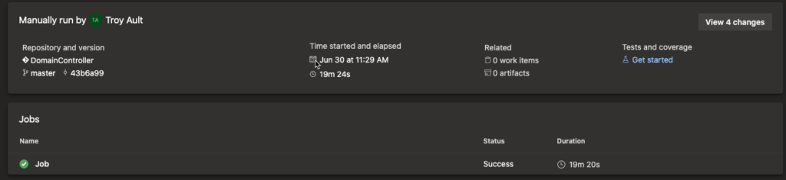

# Azure DevOps for the Data Engineer Part 1

8/10/2020

Working with customers, I often need to spin up environments to demo/test/validate different scenarios. In the past I have kept a Hyper-V lab which housed all the different versions of SQL. This became a management overhead to ensure they were up to date. In addition, the number of releases and the supported platforms continued to increase. Customers also are looking to move their data workloads to Azure and therefore are looking at ways to automate. In the past I developed ARM templates for most of the SQL Server scenarios to aid in this. Testing was painful and caused for these templates to become outdated over time. The answer is to put them into a pipeline to ensure there are not steps missed in the deployment. Unfortunately, I was unable to find documentation on how to implement an ARM template within an Azure DevOps pipeline.

Therefore, I have worked through the process and would like to document for others and myself to reference later. My approach was to develop ARM templates which could be leveraged like Lego pieces to build out several different pipelines. The two pieces which will be used for all my SQL deployments are domain controller and workstation. For this post I will walk through the domain controller template, talk to what changes you will need to make, and show how you can build a simple DevOps pipeline to deploy it.

## Setup Dependencies
Let’s get started. First thing you will want to do is to fork the [DomainController](https://github.com/aultt/DomainController) repository. You will need to update a couple of the files before you are ready to deploy, however, first let’s walk through things you will need to have deployed in your Azure subscription before making file changes. You will want to deploy/verify each of the following, storage account, key vault, virtual network, before moving on to modifying files. Within your key vault you will want to create two Secrets, one for the domain admin password and one for the local admin password.

Now that our prerequisites are complete let’s open the GitHub repository we downloaded and see what is included. After you have downloaded it, open the folder in Visual Studio Code. You will find the files which are shown in the picture below:

## DSC Configuration changes
First item on the list is the DSC folder. Within the folder we will find all the DSC modules we will leverage to build out our domain controller (DC) and DSC configuration file. If you aren’t familiar with Desired State Configuration (DSC) check out my earlier posts which walk through it in more detail. For this post we will walk through how to modify files to deploy your DC but won’t walk through how DSC does the work. Within the DSC folder the only file you will want to update is the Domain.ps1 file. Within this file there are users who are created for our environment.

Above are the five items you may want to change, three domain users and a domain group. Two of the user accounts are for our SQL Server SQLSvc and SQLAgt. If you want these to be different just place the name you would like them to use instead. Third user is the user I leveraged for development and was added to the DBA group which is the fourth and fifth item to change.

## Azure Resource Manager Template
### Modify ARM template
We now are ready to look at our ARM template and parameters file. Open up azuredeploy.json in Visual Studio Code. We have one line we need to update here, line 101 which is our artifacts location. Replace <YOUR_STORAGE_ACCOUNT_NAME> with your storage account name. Within in your storage account you will need to have a container created, in my case I created one called artifact. If you name your container differently please update it here as well.

### Modify ARM Parameter File
Next lets open azuredeploy.parameters.json. This file holds all our parameters which are passed to our ARM template we just modified. You should review each parameter here but at a minimum you will need to update line 17, 31, 37, 40 46 and 49. Below each is described:

17 & 31 – Provide your subscription id, the resource group name where your key vault resides and your key vault name. Additionally, if you did not create your secret names as DomainAdmin and localadminPass update these to the corresponding secret name.

37 – Enter the resource group name where your virtual network resides.

40 – Enter your Vnet Name

46 – Enter your Subnet Name

49 – Replace <YOUR_STORAGE_ACCOUNT_NAME> with your storage account name and if your container is not artifact please update to the corresponding container name. _artifactsLocationSasToken on line 51 should not be modified.

Aside from line 51, all other parameters can be modified to fit your needs. Line 51 is for SaS Token which we dynamically build and should not be modified.

We have now modified all the files needed to call our template from a DevOps pipeline. Three additional files reside in our repository we haven’t yet discussed, DomainDeploy.ps1, azure-pipelines.yml, and azure-pipelines-release.yml.

### Modify Manual Deployment Script
DomainDeploy.ps1 can be leveraged to manually deploy your ARM template. This is often how I run the first couple of times to validate the DSC configuration. If you want to leverage this, you will want to look at the first four lines. $resourceGroupName and $resourceGroupLocation is the name of the resource group where the virtual machine and corresponding resources will be created. $templateFile and $templateParm should point to where you forked your repro locally.

## Azure DevOps Pipeline
azure-pipelines.yml defines our Azure DevOps pipeline. We will walk through modifying this in your environment. Before modifying the file, we first need to have a DevOps project. If you don’t have an existing one create a new project. Next click Pipelines.

Then click New Pipeline. You will be presented a screen like below:

Your code needs to be associated with a repository to leverage DevOps, you can leverage an Azure Repos or one of the others listed above. Once you select your provider, you will be presented with your repos and will select the repo you are attaching this pipeline to.

## Continuous Integration Pipeline
After selecting the repo select existing Azure Pipelines YAML File and select azure-pipelines.yml. You will be presented with the following view:

Notice there are items which will need to be update below the red arrow. To update these, click the Settings where the error is pointing. An additional window will be displayed on the right for you to select these values as shown below:

Select your Azure Subscription, Storage account and container name and click Add. Your CI pipeline is now ready to save and run. So, what did we just accomplish? Let’s walk through our CI pipeline. The first item in the file is trigger, notice it has a value of master, any time the master branch is updated Azure DevOps will kick off the pipeline and do the steps listed here. The remainder of the steps zip all the DSC modules and configuration script in a zip file, publish the artifacts to a container and then copy the zip file to our azure storage account so our ARM template can reference it. ARM templates which reference external files must be stored in some form of external storage today. Now that our CI pipeline is built, anytime we add a DSC module or update our DSC configuration the pipeline will zip them all and copy them to our storage account automatically.

## Release Pipeline
The final script is azure-pipelines-release.yml which is our release pipeline. We will leverage this any time we want to deploy our pipeline, which in this case is our domain controller. Eventually we will have a release pipeline which deploys all the servers for our environment. Let’s look at our final file. As before, create a new pipeline, select your repository, select your repo, and then select azure-pipelines-release.yml. The diagram below depicts the file and the things you will need to modify.

First you will want to Click Settings above line 8 marked number 1. This will allow you to select the appropriate Project which will populate the project ID. Once your project is selected you can select the Build Pipeline which we created earlier, and the pipeline ID will be populated for you. Once complete click Add. **Task pulls artifacts local to build server.

Next select Settings above line 17 marked number 4. This again will pull up another window for you to allow you to select the subscription the script will run against. After you select your subscription modify the inline script replacing the storage account name with your storage account name. Once complete click Add. **Task is a PowerShell task which will get a SASToken for our storage account, which allows DevOps to pass the token to the ARM template which is called next.

Finally select Settings above line 28 marked number 7. Once this is pulled up select the Azure Resource Manager connection and the subscription. Once complete go to the Override template parameters and modify the VMName and Domain Name to match what you would like. Override parameters allow you to override anything which is provided in the azuredeploy.parameters.json file. Once complete click Add. **Task calls our ARM template and passes overrides and SAS token to kick off our deployment.

## Deploy Pipeline
You can now Save and Run your DevOps pipeline. Once you run it will show the Status and Duration as below.

You have now successfully deployed a domain controller with a DevOps Pipeline. In my next Blog Post we will incorporate the workstation and SQL server with a Pipeline to put them all together.
