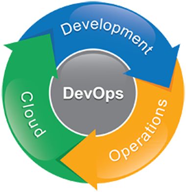
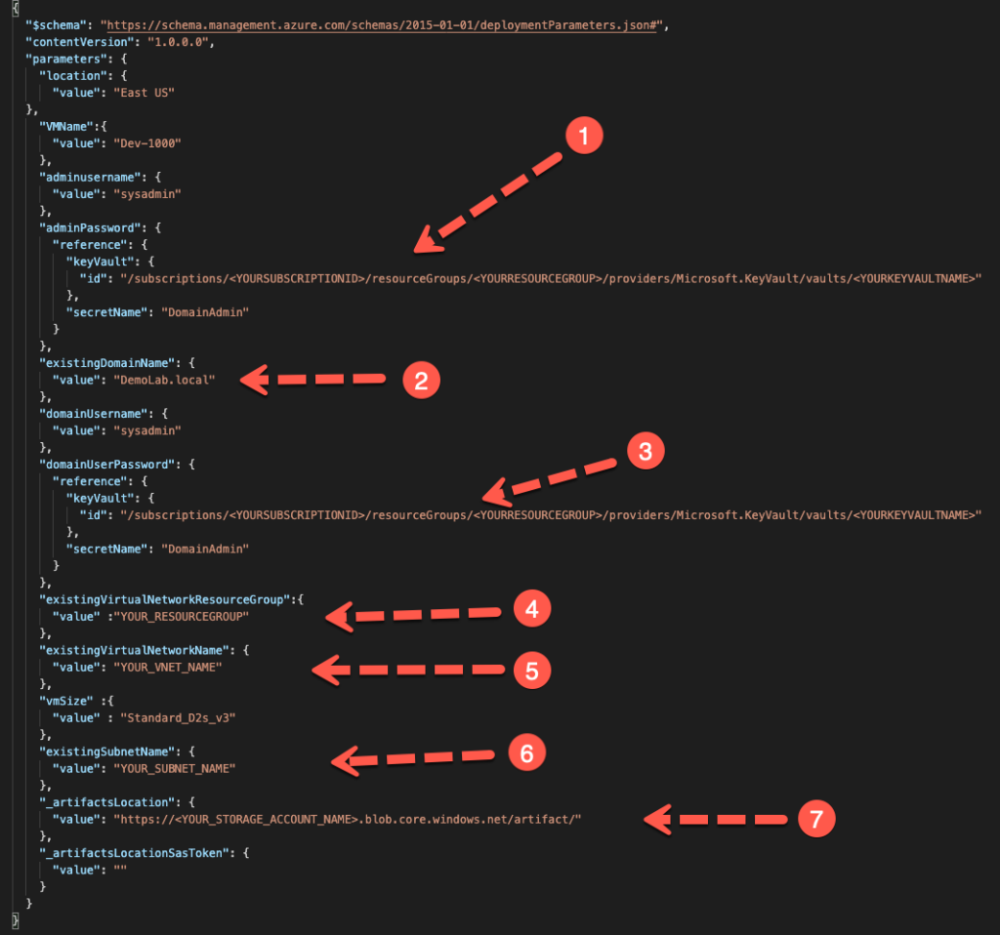
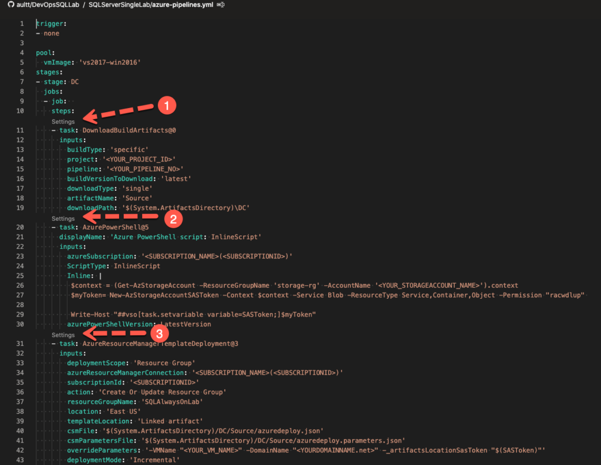
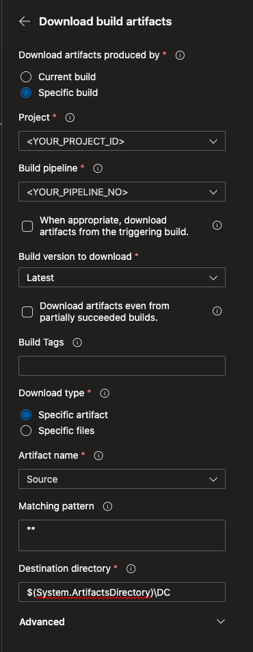
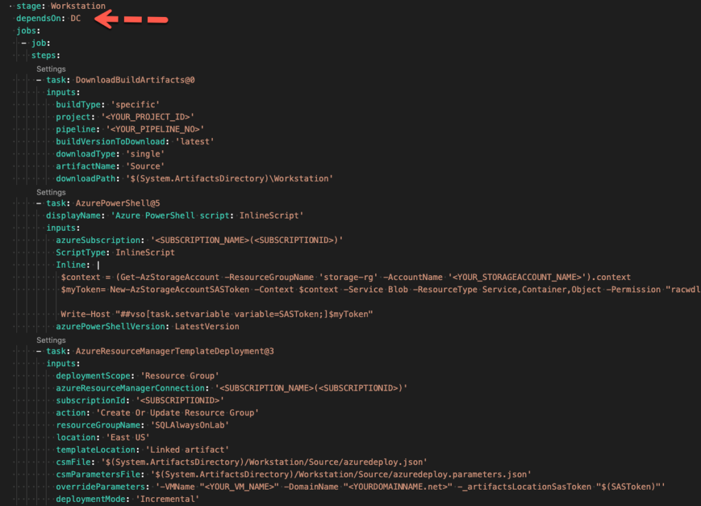
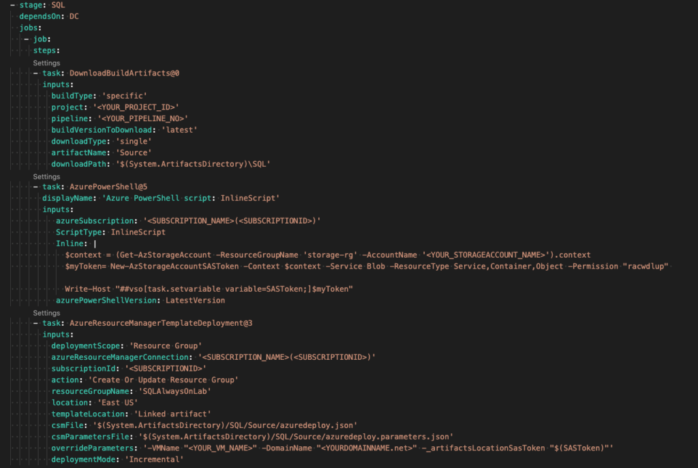
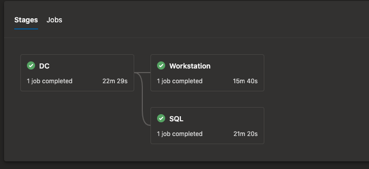

# Azure DevOps for the Data Engineer Part 2

Welcome back as we continue from our previous discussion, where we discussed deploying a domain controller in Azure with ARM and DevOps. If you missed it, read the previous blog post. Here we will leverage two more ARM templates which I have published to my GitHub account. The first one is [DeveloperWorkstation](https://github.com/aultt/DeveloperWorkstation).

**Note to keep this post from becoming too long I will not cover creating the CI pipeline for the workstation and SQL Server. Please loop back to the previous post and follow the same steps.

### Developer Workstation
This ARM template will create a virtual machine, place the machine in our domain which we created previously, set the time zone, and finally install all our development tools we will want to leverage in our lab. Currently, the DSC configuration script installs the following components:

1. Azure Data Studio
2. Plugins for Azure Data Studio for PowerShell and SQL Server admin
3. AZcopy
4. SQL Server Management Studio
5. VSCode
6. Plugins for VSCode for SQL Server and PowerShell

Installation of the tools is done leveraging the DSC module for Chocolatey. Therefore, adding additional tools is simple.

We will need to update our azuredeploy.parameters.json file as we did earlier for our domain template. Below is the minimal values you should update.

Number 2 is optional as you could leave your domain DemoLab.local, but you may want to change to something more relevant. Update these values, save the files off and commit to your personal repo.

### SQL Server Stand Alone
Next, we will walk through our SQL Server ARM template which can be found in my GitHub and named [SqlServerSingle](https://github.com/aultt/SQLServerSingle). If you have utilized any of my SQL Server templates in the past then you will find this familiar. There are a few minor changes which I have done. Looking through the DSC configuration script, you will find the template supports SQL Server from SQL 2016 through SQL 2019. Like our developer workstation the configuration will place our SQL Server in our domain, set our time zone, install SQL Server, set all best practices, and create an SPN for SQL Server. Wait did you say SPN? Yes, once this is all put together, we will have a fully functional lab environment which leverages Kerberos authentication. Now that we understand what our configuration will do, let’s look at the changes we need to make to our parameters file.

As before, number 3 is optional as this is the domain name. In this template there is one additional change which is needed as we now have a SQL Service account that we need to retrieve a password for. You can now save and publish all your code to your repo as we move to the final piece, the DevOps pipeline.

### DevOps Pipeline
Finally, we have all the pieces together to build our first pipeline which will deploy a fully function lab environment. I decided to separate the DevOps pipelines out to their own repo, so head over to my GitHub and download [DevOpsSQLLab](https://github.com/aultt/DevOpsSQLLab). Once you have forked the repo, open the azure-pipelines.yml file which is under the SQLServerSingeLab folder. You may ask why a folder? I will be adding additional pipelines here going forward as customers request or I find the need. Open the file in VSCode, notice unlike our last yml file we now have a stage line within our file. This allows us to set dependencies on one stage completing before another one starts. We are going to break this file into three sections. First section is stage DC.

### Domain Controller Stage
You have options when editing this file, you can edit it directly in Visual Studio code if you like, however, you will have to know the project id and number which isn’t easy to determine. My preference is to open the file up within my DevOps pipeline and edit it directly in the pipline. Take a look below at the screenshot and I will explain why.

As you can see above, we have three sections under DC which should look similar to what we saw in our domain controller pipeline. Above each is a Settings title which shows up in our pipeline. If you click this, then DevOps will present a fly out to the right with drop downs for you to select the Project and Build Pipeline. Here you will select your DevOps Pipeline along with your Build pipelines associated with your domain controller. Once complete, click add and this will be added back to your YAML file.

Continue to the next two items and modify the tasks as you did for the domain controller release pipeline previously. Once complete with each, click add and save back to the YAML file.

### Workstation Stage
Next stage is workstation. Walk through and make the same changes as you did above clicking add each time you complete a task. There is something additional to note here. Since we are leveraging stages, we can now set dependencies. As depicted in the diagram below, we set a dependency on domain controller as we cannot add the machine to the domain if the domain does not exist.

### SQL Server Stage
Finally, we are to our SQL Server stage. Follow the same process we have for the last two sections. Once complete, save your pipeline, give it a name, and run the pipeline.

After you run the pipeline you will get a graphical presentation of each stage of the pipeline. Below I show the pipeline once it has completed. Notice we get times for each stage of the pipeline, so we know how long each ran. Also take note workstation and SQL will not begin until DC has completed.

### Wrapping Up
We now should have a fully functional lab environment for SQL Server. We can test any SQL Server functionality including Kerberos authentication. More importantly with our DevOps pipeline, we now have a YAML file we can work with to build even more complicated pipelines which have additional dependencies. For instance, think of multiregional environments where different components have dependencies on another resource. The possibilities are endless. Hopefully, you have found this exercise beneficial as always if you have questions add a comment or send me an email.