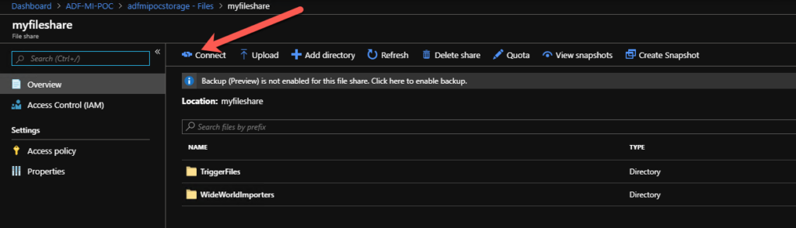
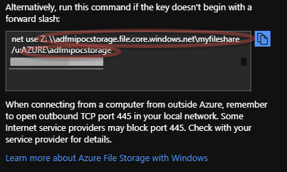
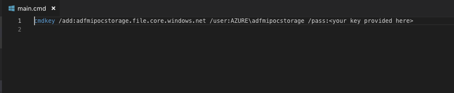
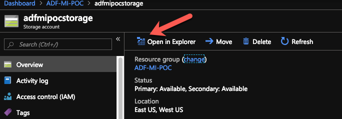
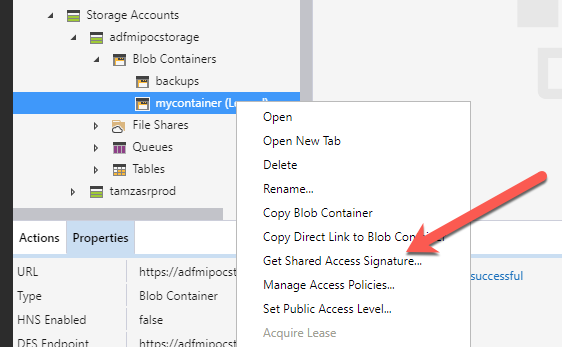
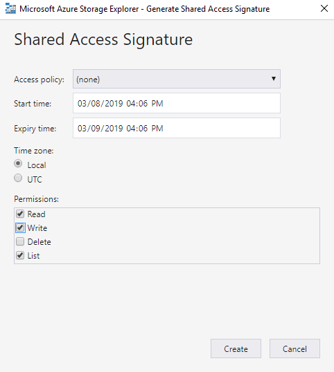
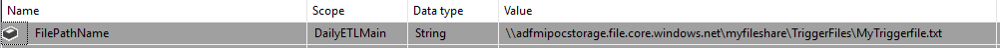

# Lift and Shift SSIS to Azure

With SQL Server 2008 end of life around the corner, July 9 2019 for those not aware, many companies are looking to lift and shift their SQL environments to the cloud. In doing so, most companies are looking for the opportunity to move to Platform as a Service (PaaS) because of the savings.

When we talk lift and shift of data, most times my discussions have been around moving SQL Server to Azure SQL Managed Instance. What about the other services which companies have leveraged for years on-prem? One of the services being SSIS which many companies have invested time and resources developing data flows. Luckily, these can be fairly easily lifted and shifted in in Azure with minimal or no code changes. Within this blog post I will discuss many of the steps required to configure the SSIS runtime, but more importantly, I will call out all the references to the official documentation for each component.

First thing that will be required is SSIS integration runtime. With the integration run time, we can leverage Azure SQL Database Server or Managed Instance to deploy our SSISDB. Is the concept of Integration runtime(IR) in Azure Data Factory a a new one to you? If so, then take a look at the following [documentation](https://learn.microsoft.com/en-us/azure/data-factory/concepts-integration-runtime) which details all the different IR types available. A brief description of SSIS IR is the following taken from the documentation referenced above:

Azure-SSIS IR is a fully managed cluster of Azure VMs dedicated to run your SSIS packages. You can bring your own Azure SQL Database or Managed Instance server to host the catalog of SSIS projects/packages (SSISDB) that is going to be attached to it. You can scale up the power of the compute by specifying node size and scale it out by specifying the number of nodes in the cluster. You can manage the cost of running your Azure-SSIS Integration Runtime by stopping and starting it as you see fit.

Creating the SSIS IR is [documented](https://learn.microsoft.com/en-us/azure/data-factory/create-azure-ssis-integration-runtime) very well for both deploying through the portal, PowerShell, or via Azure Resource Manager template. Depending on what your packages utilize you may need to do some custom configuration of the SSIS IR. [Documentation](https://learn.microsoft.com/en-us/azure/data-factory/how-to-configure-azure-ssis-ir-custom-setup) around limitations and considerations should be reviewed. Custom setup lets you alter the default operating configuration or environment (for example, to start additional Windows services or persist access credentials for file shares) or install additional components (for example, assemblies, drivers, or extensions) on each node of your Azure-SSIS IR.

The example I ran into recently was leveraging windows files shares within a package. If the SSIS package is relatively small, then updating file shares and changing them over to a URL to a blob store may be simple. However, if the package has many references to UNC paths changing, then these could be time consuming and require much regression testing. Luckily the steps to prevent this work is relatively easy.

[Documentation](https://learn.microsoft.com/en-us/azure/data-factory/ssis-azure-connect-with-windows-auth?view=sql-server-2017) exists for connecting data sources and file shares with SSIS packages in Azure, however, for my specific example it wasn’t crystal clear the steps that were required. So I’m documenting here in hopes it will save others some time. In order to move forward, you will need an already configured SSIS IR and a storage account with files shares. We covered SSIS IR earlier in this post. If you need assistance in creating the storage account and file share, then there is a nice walkthrough which can be found [here](https://learn.microsoft.com/en-us/azure/storage/files/storage-files-quick-create-use-windows). Ensure you have a blob container created and a file share.

Now we have our pre-reqs we can move to our custom configuration of our SSIS IR. We need to collect some information from our file share, specifically the username and key. To do this, navigate to the storage account, select Files, then select the file share you created. Next click Connect as shown below.

After selecting this you will be presented with options for Windows, Linux, and MacOS. For our purposes we just need the UNC path, the user name, and the key. I have cleared out my storage key but show both the others below.

Once we have these three then we can now move to create a main.cmd file which will be called by the SSIS IR. Below you will see the contents of our file. You will want to replace the with your URL, user, and pass. you obtained above. Save this file as we will upload it to our blob store next.

Next we need to upload our main.cmd file to the container we created in our blob store. Navigate to this container and upload the file. Once you have uploaded the file, we then need to create a Shared access signature. The easiest way to do this is using Azure Storage Explorer. You can easily launch it by going to the overview of the storage account and clicking Open In Explorer.

If you don’t have Azure Storage Explorer downloaded, then it will provide a link for you to download it. If you do, then you can launch it directly from the portal. Once storage explorer is opened you will need to connect to your azure subscription and browse to your storage account. Right click on the storage container and select Get Shared Access Signature.

Ensure you grant Read, Write, and List permissions for the signature. You will want to consider how long this Signature should be valid. Once this expires you will need to reconfigure your SSIS IR. Whatever you decide, make a note and a reminder on your calendar to update it once it expires. Once you click Create you will be presented with the URL and Query string. Copy both and store for later.

Finally we are ready to configure our custom SSIS IR and then start it up. To make this easier, I have provided a PowerShell script that you will need to update four variables at the top of the script and then execute it. The script is available on my GitHub account and its name is [ReconfigureSSISIR.ps1](https://github.com/aultt/ProofOfConcepts/tree/master/SanitizeDBandUploadToAzure/PowerShell). Download the PowerShell script and update the following variables at the top of the script $MyDataFactoryName , $MyAzureSsisIrName, $MyResourceGroupName, $MySetupScriptContainerSasUri. MySetupScriptContainerSasUri is the URL you copied from the previous step.

You have now successfully configured your SSIS IR with a custom configuration which will allow your packages to reference a UNC path. Your package variables will now reference any file within the File Share as below. No credential are required because the custom configuration handles the authentication. If you haven’t deployed the package already then deploy the package to SSIS DB. You can now execute the package directly from SSIS DB catalog or create an ADF pipeline to execute the package.

This concludes our custom configuration of the SSIS runtime, however, I would like to point out a few other things which may come up as a need as your are lifting your packages into Azure.

If you have the need to copy files from your on-prem datacenter into Azure, then you will need to also have a [self-hosted integration runtime](https://learn.microsoft.com/en-us/azure/data-factory/create-self-hosted-integration-runtime?tabs=data-factory). This is a very easy setup, just requires downloading an MSI and installing it on an existing server. Something to consider if you are moving files to an azure storage and you have configured [Azure Storage Firewalls](https://learn.microsoft.com/en-us/azure/storage/common/storage-network-security?tabs=azure-portal), then you will want to ensure your self-hosted integration runtime resides on a virtual machine running in a Vnet/subnet which is permitted through the firewall.

Two addition links I would like to provide you in case you find the need to [call an Azure Data factory Pipeline through code](https://learn.microsoft.com/en-us/azure/data-factory/concepts-pipeline-execution-triggers) or [schedule start and stop of SSIS IR](https://learn.microsoft.com/en-us/azure/data-factory/how-to-schedule-azure-ssis-integration-runtime).

Hopefully someone will save some time and frustration with the resources here today or at least utilize it for reference for the underlying articles. Happy Automating!