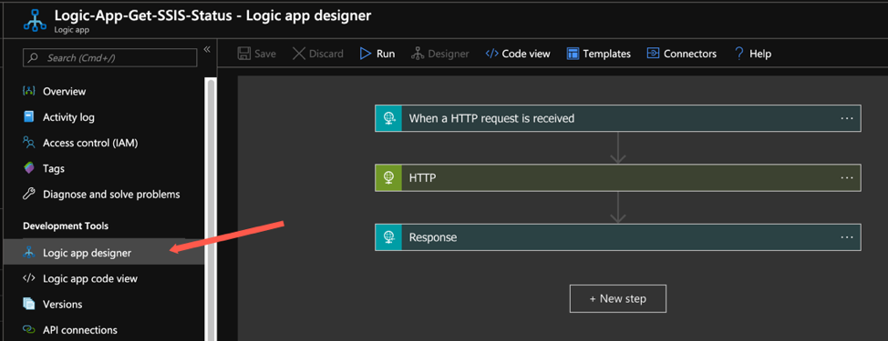
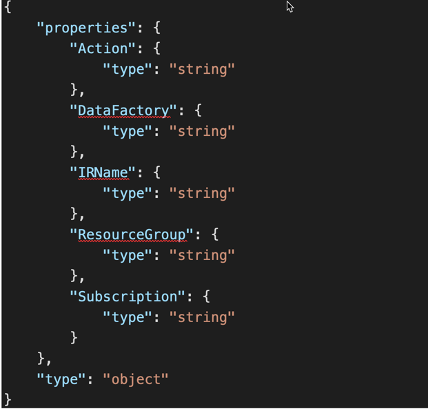
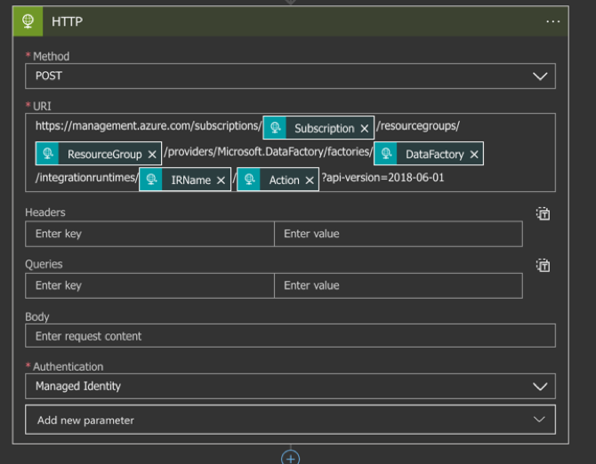
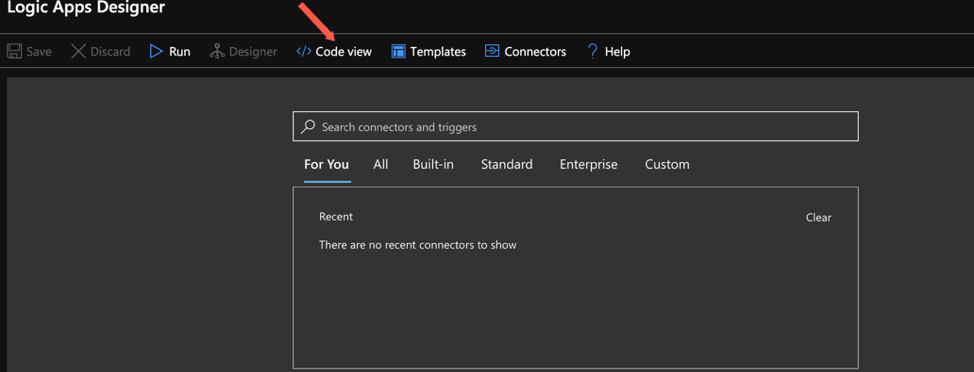
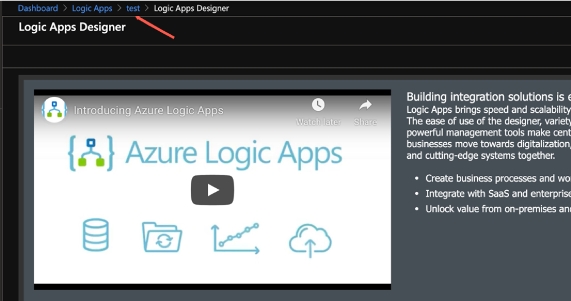
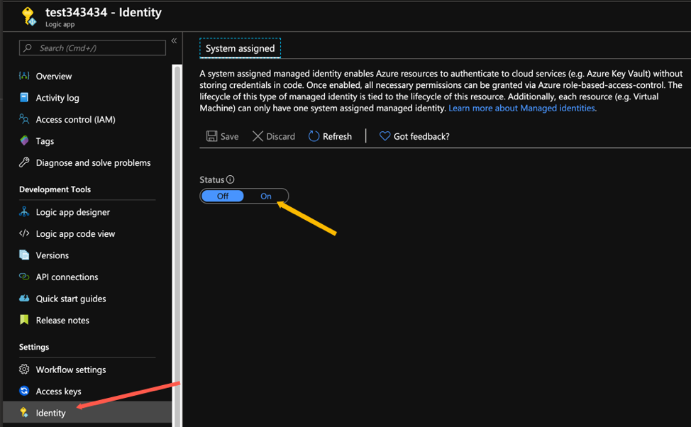
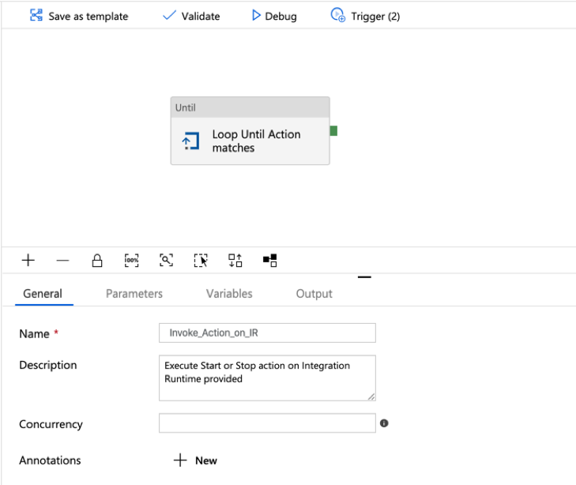
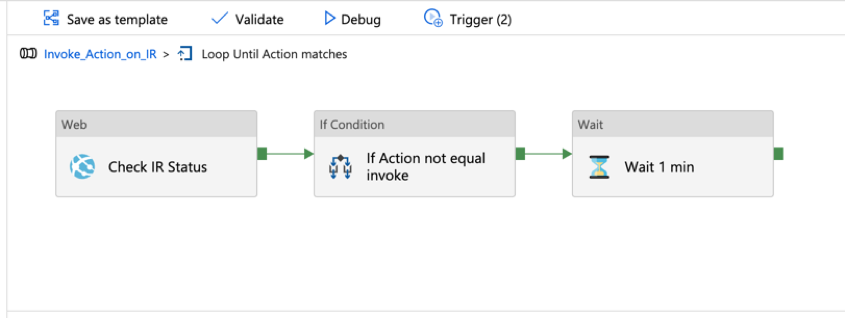

# Managing Azure Data Services Costs through Automation

Cloud computing cost management…  Do you have services which should be running only during a pipeline?  Do you have a lab environment which you want to ensure isn’t running after hours?  There are multiple ways to manage and ensure minimal cost.  My first iterations were leveraging automation accounts.  These work well if you are comfortable writing code and the activity can be scheduled, however, recently I have been working with customers leveraging SQL Data Warehouse, Azure Analysis Server, and Integration Runtime.  These technologies often work as part of a pipeline run, and therefore can be started before and stopped immediately after.  Azure Data Factory (ADF) is often leveraged for moving data between data tiers, so I began my automation journey here.  Within ADF, you can automate almost anything with in Azure utilizing the web task.  Each of these are similar in implementation and all code is provided in my GitHub POC repo under [AutomatedResumePauseDataServices](https://github.com/aultt/ProofOfConcepts/tree/master/AutomatedResumePauseDataServices).  For this blog, I will walk through the concepts as it relates to Azure SSIS Integrated Runtime (SSISIR).  Let’s get started with the simplest approach of leveraging ADF to stop/start SSISIR directly.  Microsoft provides an article which will walk you through how to do this [here](https://github.com/aultt/ProofOfConcepts/tree/master/AutomatedResumePauseDataServices) as well as how you can leverage an automation account with a run-book if you prefer. 

While this provided the basic functionality, I wanted to have something more robust and something which could be easily shared with customers.  Therefore, I leveraged ADF with a mix of Logic Apps to provide more flexibility and usability. Two logic apps were developed per service, one for status and one for action.    Providing a way to check status ensures we only act when needed and also eliminates unwanted error messages. 

Let’s dig in and dissect the Logic App for SSISIR status.  We have two different ways to look at a logic app, through a designer or through code.  We will look at both, but we will look at the designer first. After opening up the logic app click Logic app designer on the left.  From here you will be presented with the view shown below:

To look at the actual properties we will just click the selection when a HTTP request is received.  From here we see two different properties which are important, HTTP Post URL and Request Body.  HTTP Post URL is the URL which we will leverage in ADF to call the Logic App and the request body will hold the parameters which we will pass to the logic app to perform an action. Within the request body you will see the following JSON:

These are values which we will need to pass to our logic app.

Next click HTTP so it also expands.  HTTP is the rest call we will be leveraging in this case to get the Status of our SSIS IR.  Take a look at the screen shot below:

Notice we have what appear to be variables in our URI.  These are the same values which we saw defined above in our request body.  We are leveraging them to allow for flexibility in calling our logic and for code reusability.

Finally click on Response and you will see something which resembles below:

As we are getting a status, we return the Status code and the body of the response to be further interrogated.

Alternatively, we could look at the logic app through code view. Since the logic app is ultimately just JSON, it makes it very simple to source control and provide as a community resource for others to consume.

Next let’s look at the SSISIR Action Logic app. 

The biggest difference I would like to note here is there is no response within the logic app.  Since here we are not getting the status but rather doing an action there is no response back.

So now the question is how do we deploy these logic apps, and more importantly how do we leverage them?  Let’s first talk about how we can deploy them with the code we can obtain from GitHub.  First thing to do is create a logic app and give it a name based on your naming standards.  For my SSISIR status logic app I named it Logic-App-Get-SSIS-Status.  For purposes of demonstration here I am going to leverage a logic app I named “test”.  Once you create the logic app then you will be presented with the following screen.

Since we are leveraging code and not the designer, we have a couple of options here.

Select Blank Logic App Template.  After which you will need to select Code view as below:

Scroll the window pane to the left and then select Logic app code view
Click your logic app name above and then select Logic app code view

Now that you are in the Logic App Code view you can simply grab the JSON for Logic-App-Get-SSIS-Status from the GitHub repo [here](https://github.com/aultt/ProofOfConcepts/tree/master/AutomatedResumePauseDataServices/AzureSSISIR/LogicApp).  Replace the entire JSON document in the logic app with the code from GitHub.  Save your logic app and then select Identity along the left side.  Here you will see System assigned identity is currently off. We want to turn this on and click Save.

Once complete follow the same steps for Logic-App-POST-SSIS-Action.  After completing this your logic apps are built and ready for consumption.

Consuming our logic apps will be done through an ADF pipeline.  Our pipeline will leverage both our status and our action logic app.  Below we show the GUI representation of the pipeline.

Within our loop, we have the following actions:

First task is a web call to our logic app to get the status of the SSIS IR.  After the return, the output is interrogated. Based on the action passed, if it doesn’t match then it will call the action logic app to ensure the state matches.  ADF will continue to loop until the status of the SSIS IR matches the requested state.

As with logic apps, ADF pipelines are ultimately just JSON documents as well.  Again the JSON for the ADF pipeline can be found in my GitHub Repo [here](https://github.com/aultt/ProofOfConcepts/tree/master/AutomatedResumePauseDataServices/AzureSSISIR/DataFactory). 

Key points here are the parameters listed at the bottom of the script.  When you go to deploy this to your ADF, you will want to replace the default values with your values for your environment.  When you are ready to create your pipeline, head over to ADF and create a new pipeline by clicking the + followed by clicking the Code icon in the upper right corner as depicted below:

From here you can replace all the code with the code from the ADF JSON found in GitHub.  After pasting in the code, be sure to make the following changes:

Subscription: Subscription Name where SSIS IR resides
Resource Group: Resource Group where SSIS IR resides
IRName: Name of SSIS Integration Runtime
GetStatusURL: URL of Logic app for status
PostActionURL: URL of Logic app for action
All of the above will likely be obvious, however, the last two may not.  These are the URLs which are associated with the Logic apps that ADF will call to leverage.  To find these, you will go back to the Logic app into the Logic app designer.  Once in the designer, click “When a HTTP request is received” and copy the HTTP POST URL.  This is the URL you will need for both the GetStatus URL and Post Action URL.

The final piece to add before testing out the automation is the Access control policies for the logic app and the data factory.  First let’s go to our data factory, once there click on Access control (IAM) on the left.

From here Click Add…

For the Role, select contributor, and for Assign access to, select Logic App.  Finally select the logic app you added and click save.  Do this for each logic app.  Now your logic apps all have access to ADF.  Similarly, you will want to go to logic apps and ensure Data factory service has contributor role for each logic app.

Now you have an ADF Pipeline that can be called to stop/start the SSISIR.  You can choose to call this pipeline as part of another pipeline, or you could also create a trigger to call this on a schedule.  In my case, I have a trigger which runs at the end of each day to ensure all my data services have been shut down so that I don’t incur unneeded expenses. 

If you find this helpful, then you can follow the same process to create the Azure SQL DW and Azure Analysis Service pipelines.  Please feel free to provide comments and feedback.  