# Moving Databases with TDE to Azure SQL MI
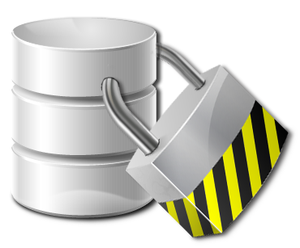

1/19/2020

Many customers are long on their journey to Azure, while some are just beginning. As customers begin to look at migrating databases, security is typically the first discussion point. By default, Azure SQL encrypts data at rest and in transit. Azure does this utilizing a system managed key, however, you may also bring your own key (BYOK) if you would like too.

In this blog post I am going to discuss moving a database to Azure SQL Managed instance which is currently leveraging transparent data encryption (TDE). There are three options of how this can be implemented. The first is to configure your Managed Instance (MI) to utilize a customer-managed key. Reference documentation can be found [here](https://learn.microsoft.com/en-us/azure/azure-sql/database/transparent-data-encryption-byok-overview?view=azuresql). The second is to just restore your database to MI and allow MI to manage the encryption key. Reference documentation can be found [here](https://learn.microsoft.com/en-us/azure/azure-sql/managed-instance/tde-certificate-migrate?tabs=azure-powershell&view=azuresql). The third is to leverage a managed service, Data Migration Service (DMS), which will restore the database and migrate the certificate for you. Reference documentation can be found [here](https://learn.microsoft.com/en-us/azure/dms/tutorial-sql-server-to-managed-instance#configure-migration-settings).

For this blog post I will focus on option two as the scenario I am looking to fulfill is one where is customer is refreshing a database in Azure on a schedule. DMS is targeted as a tool to migrate the application to Azure, however, in this case we are doing continual testing and want to leverage updated database backups from on-prem. Therefore, for this post we will walk through how to move the certificate to Managed Instance as well as walk through how you can automate the database restores.

First step we will need to do is setup a database and enable TDE. To do this I referenced Microsoft documentation which can be found [here](https://learn.microsoft.com/en-us/sql/relational-databases/security/encryption/transparent-data-encryption?view=sql-server-ver15). As this is documented well, I will just provide my [script](https://github.com/aultt/ProofOfConcepts/blob/master/SQLDatabaseRefreshtoSQLMI/EnableTDEandbackupcert.sql) as reference. If this is unclear please comment and I will provide additional details.

We now have a functioning TDE database on our server and can begin the process of exporting the certificate. If you are attempting to migrate a certificate from an existing database you may get an error and discover that your certificate is expired. While this does not prevent TDE from functioning, it will require you update the certificate to a valid certificate before you can export. This task is relatively easy. First you must create a new certificate. Command below is an example.

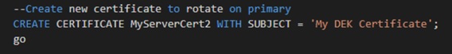

Once the certificate is created, if this is a stand alone SQL Server, then all we need to do is rotate the certificate in. We can do this with an alter database command as shown below:

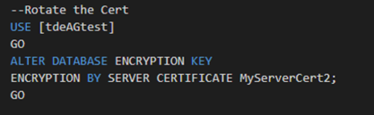

Finally, we can validate our database is leveraging the correct certificate with the following command.

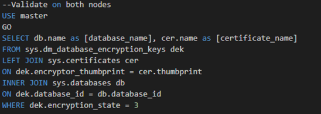

What if we were leveraging Always On Availability Groups and our database was participating? Do we need to suspend data movement? Do we need to un-encrypt the database? Luckily, the answer is no. All we need to do is create the certificate on the primary, export the certificate, and then create the certificate on each secondary. An example of creating the certificate from a file is listed below:

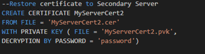

After the certificate has been created on all nodes, the alter command can be run from the primary followed by the validation query on each server. If by chance the alter command is run before the certificate has been created on each secondary, all is not lost. You will, however, need to resume data movement once the certificate has been created.

Now we have a TDE database which has a valid cert and we can begin the process of exporting it and migrating it to Azure SQL Managed Instance. Before we can move forward with the script to do this, we will want to validate that we have a few tools installed on our machine. Two PowerShell cmdlets are required, Az.keyvault and Az.Sql.

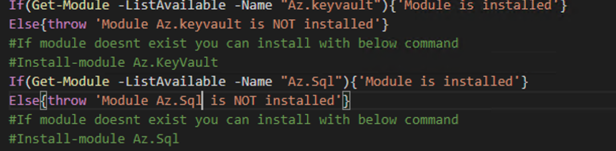

As you can see above the script will throw an error if they don’t exist, however, the command to install them is also provided. Installing them will require you run PowerShell as an admin. The next tool required is pvk2pfx.exe. This command line tool is provided as part of the Windows 10 SDK. It maybe confusing on how to install this, therefore, I am providing additional information. First, it requires you have Visual Studio installed. If you don’t currently have it installed, then you will wan to go download it first. You can download here. Once Visual Studio is installed, you will want to launch Visual Studio Installer.

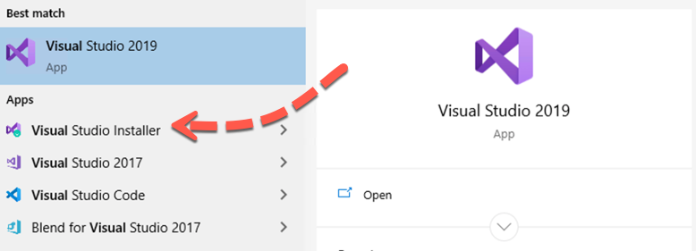

Once you are in the installer, you will click Modify next to the Visual Studio you have installed.

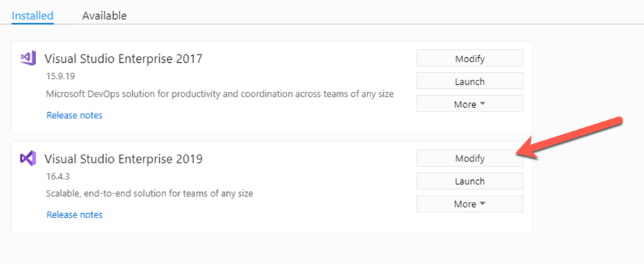

Once it has launched, you will want to select Individual components and the enable the check box next to Windows 10 SDK as depicted below:

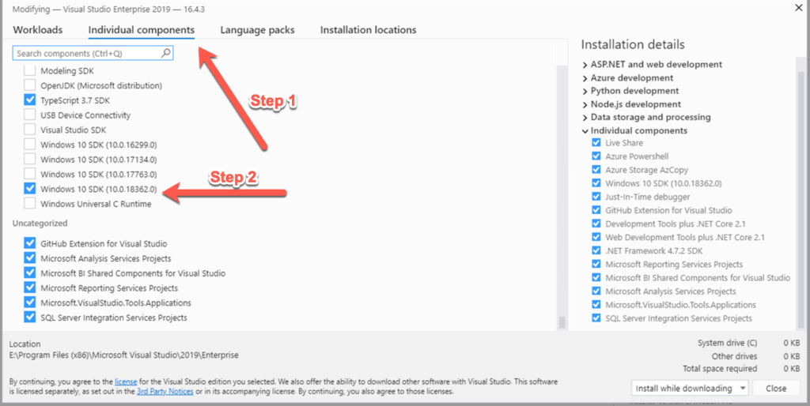

Once this has been completed, you have all the tools required to run the script to export and upload the certificate.

Let’s take a closer look at the PowerShell script we will leverage for this. First section of the script are variables we will want to set for our environment followed but some system generated variables based our environment. Each are described below.

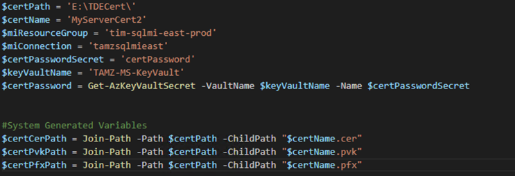

$certPath : location where we will export our certificate too.
$certName : Name which will be used for the certificate
$miResourceGroup : Resource Group your managed instance lives in
$miConnection : Name of your Managed Instance
$certPasswordSecret : Secret Name for your sa password which is stored in KeyVault
$keyVaultName : KeyVault name where secrets are stored
$certCerPath : Full path to exported certificate with .cer extension
$certPvkPath : Full path to exported certificate with .pvk extension
$certPfxPath : Full path to exported certificate with .pfx extension

Notice here we are leveraging KeyVault to store our passwords so we ensure we are not checking in code with passwords into source control. Immediately following the variables is the call to the exe pvk2pfx. This tool will convert the files which we exported as part of setting up TDE to a pfx file, managed instance requires this format. The final step of the script converts the certificate to a base 64 encoded certificate and uploads it to managed instance. We now have our certificate successfully loaded into managed instance. How do we leverage it?

Essentially from here we can restore any database which is utilizing this certificate for TDE onto managed instance with a normal restore command. Since the certificate exists within SQL Server it can decrypt the backup file and restore the database. When doing the restore MI will leverage the key which it has assigned for TDE for encryption. Therefore, you can be leveraging either BYOK or system managed key and MI will restore the database and leverage this certificate. MI allows for multiple certificates to be uploaded which ensures you can restore TDE databases from different servers or even the same server when it is leveraging a different certificate.

Finally, I mentioned earlier I would provide a way to automate the restore of the database(s) with PowerShell. Luckily this is relatively easy thanks to the community driven cmdlets at http://dbatools.io. This script will also require the use of some additional tools.

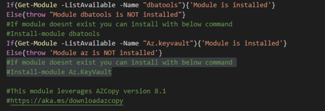

First couple requirements are PowerShell modules. As before, the script will validate they are installed and if not throw an error. The last tool required is AZCopy. AZCopy is leveraged to copy the backup files to Azure storage. There are several versions of the tool for this script I leveraged version 8.1. Next you will need to provide some environment details. Variables are listed below.

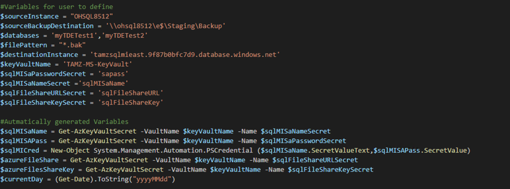

Next we will loop through the databases provided and Backup each one at a time. For clarification this backup command is setup to create a backup file once a day. If it is run more than once it will overwrite the existing file for that day. You may want to customize the backup and restore portion. If you do, then you can leverage the following command to get details Get-Help Backup-Dbadatabase -full

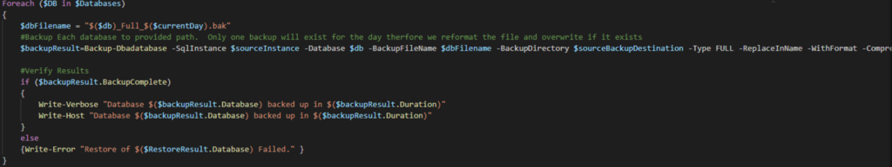

Following the backup, we leverage AZCopy to move the backup files to Azure storage. And finally we loop through each of the backup files and restore to Managed Instance.

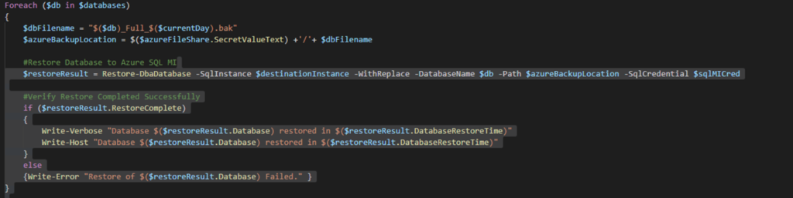

Notice we don’t need to provide any additional information for the certificate because we have already imported it to Managed Instance. We now have a script which can be scheduled to run on a regular interval to refresh one or more databases. All the scripts referenced here can be found in my GitHub location which can be found at [here](https://github.com/aultt/ProofOfConcepts/tree/master/SQLDatabaseRefreshtoSQLMI). Please let me know if there are questions or if anything needs further clarification.

