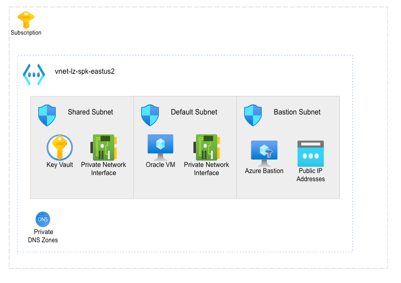
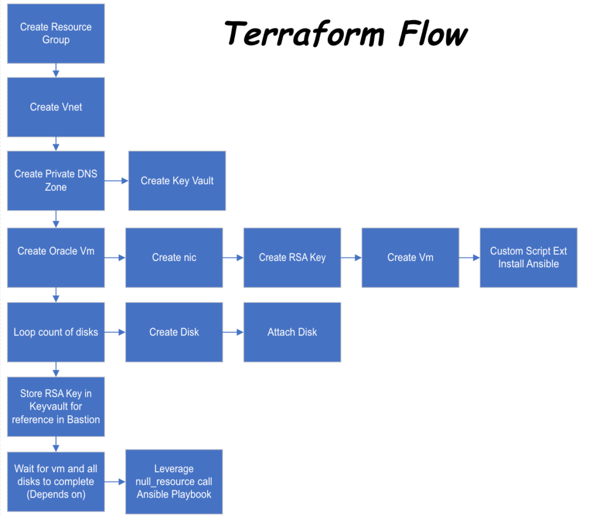
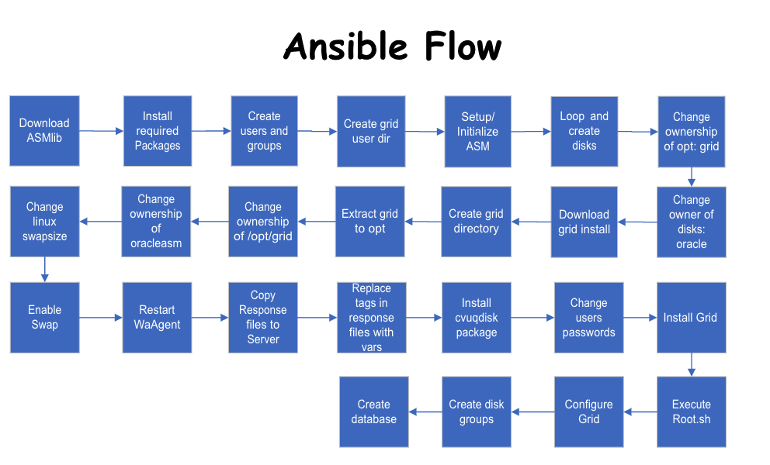

layout: page
title: "Oracle Infrastructure as Code on Azure"
permalink: /docs/pages/

# Oracle Infrastructure as Code in Azure

Are you looking to move Oracle workloads to Azure? Want to establish an Oracle development environment in Azure? Before getting started, I suggest you check out the following [video](https://www.youtube.com/watch?v=yoNZ_H2zOqk). After watching the video, you will have a good understanding of all the things to consider when moving Oracle workloads to Azure.

## Infrastructure as Code
Next, let’s discuss the tools we leverage for building out your first Oracle deployment. Terraform will deploy the infrastructure required while Ansible will be responsible for configuration of the virtual machine.

## Architecture
To isolate our environment the solution will deploy without any public endpoints. Since this is a stand along environment a new vnet is deployed which consists of three subnets. One subnet is leveraged for the virtual machine, another is leveraged key vault, and the final is utilized by Bastion. Key Vault will whitelist the public ip address of your machine to ensure you can connect after the deployment. See Architectural diagram below:

## Problem Statement
Before we dig into the specifics, let’s address the problem we are trying to solve. Today customers looking to move their Oracle workloads to Azure but don’ know where to start. Installing Oracle is a time consuming task. Often there are limited number of engineers with the background required to implement. Azure adds new VM sku’s regularly. As they are added we want to run stress tests with different size and number of disks to determine how they will perform. Automating the oracle deployment allows us to reduce time to deploy and provide a tool which could automatically test/validate a VM and disk configuration.

## Approach
Let’s walk through my approach on solving the problem. Leveraging Terraform for the infrastructure portion allows us to provide variables and allow the deployment to be easily customized. As a result you have the capability to configure the vm size, number of disks, size of disks, and caching. Terraform allows us to define a variable file which allows a you to pass and quickly deploy a POC environment. Below is a simple flow diagram for the Terraform code.

Once the terraform deployment has finished, you will need to complete one step. While this could be automated in the future or handled in a pipeline today, you need to kick off the script. First log into the VM with the Bastion Service, and the Key, which is stored in Key Vault. Next do an ls at the command prompt. Two files should exist, an ansible yml file which is the playbook, and a shell script which will deploy the playbook. Execute the playbook by typing . ./deployoracle.sh. The script should complete in approximately fifteen minutes. Once complete, the Oracle database will be configured with ASM and all the variables you defined. Below you will find a process flow of the Ansible Playbook.

## Conclusion
Not alot has changed with the installation process since my last interaction with Oracle back in the 90’s. However, there are multiple steps and it’s easy to miss a step. Now that it is documented, hopefully my work will save you and others time and frustration. You can find the GitHub solution with the documentation and supporting files [here](https://github.com/aultt/azure-oracle/tree/master/OraAzure-Terraform/Oracle_Single). As you look through the project if you have ideas for improvement please open an issue in GitHub. Thanks for reading and happy automating.
