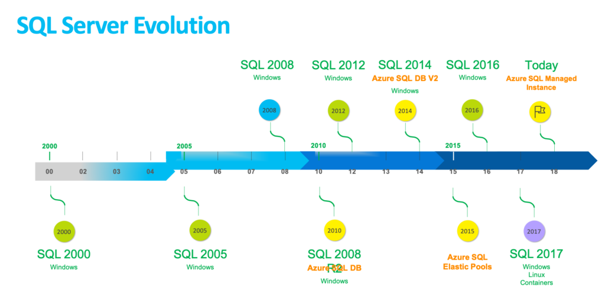
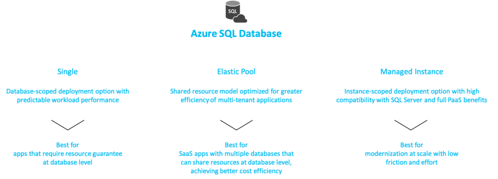
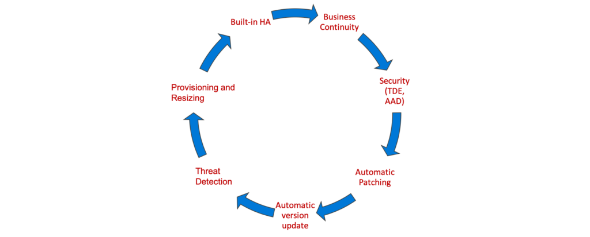

# SQL Server Modern Data Platform

Are you looking to modernize your data platform? Do you have need to quickly get off a version of SQL Server which is approaching end of life? Today I am going to walk through through the different options and help you determine how you will run SQL Server in the future.sql

Before we talk about how will will run SQL Server in the future lets look back over the evolution.

We can see very easily now that SQL Server release cycles are shorter and there is a lot of focus on SQL Server running in the cloud. In fact, SQL Server running in Azure is what is allowing the quicker release cycles. Customers are providing feedback during preview releases allowing for a faster and better product to be released. Knowing release cycles are shorter, we need to adapt how we are deploying so we can do so with shorter time and greater precision. We will cover how we can achieve both of these in the follow up posts on automation. Before we move off to automation, we need to understand all the different options we have available.

When we talk about running SQL Server, we have three different deployment models we can leverage:

PaaS – Platform as a Service
IaaS – Infrastructure as a Service
Physical Server Deployment
As DBA’s, it’s an added benefit that across all three deployment models the data platform is consistent regardless if it is on-prem or in the cloud.

Let’s talk about PaaS solutions first. Within Azure we have several PaaS Deployment offers. All PaaS offers for SQL Server fall under the Azure SQL Database umbrella. Within Azure SQL Database we currently have three options depicted below.

We call this Platform as a Service. You may ask yourself what does that mean or what does that buy me? The answer is a lot! For one, you never need to migrate again or patch. How many countless hours have DBA’s over the years spent in just these two areas? But there is more than that, we have BuiltIn-HA and Business Continuity out of the box. Do you have workloads that change from week to week or month to month? We have you covered because you can resize on the fly as well. Platform as a Service provides many advantages. Below is an image depicting them.

Now we understand what PaaS offers us. Next we need to understand the different purchasing models within the Azure SQL Database offering. There are two different purchasing models, vCore and DTU, of which there are different Service Tiers.

DTU-based Purchase Model
What is a DTU you ask?

A [Database Transaction Unit] is a blended measure of CPU, memory, data I/O, and transaction log I/O in a ratio determined by an OLTP benchmark workload designed to be typical of real-world OLTP workloads. Doubling the DTUs by increasing the performance level of a database equates to doubling the set of resource available to that database.

Now we know what a DTU is, let’s talk about the different Service tiers. There are three tiers: Basic, Standard, and Premium. All three tiers will provide 99.99% uptime. The differences comes with the blended ratio of resources you get. Microsoft provides a break down of the differences [here](https://learn.microsoft.com/en-us/azure/azure-sql/database/service-tiers-dtu?view=azuresql).

vCore-based Purchase Model

The vCore model allows you to independently scale, compute and storage. This model will feel very similar to how you have managed your on-prem SQL environments. In addition, with vCore you have the ability to exchange your existing SQL licenses.

Within the vCore model, we have different generations of Hardware we can select from as well as different service tiers.

Gen 4 – up to 24 logical CPUs on Haswell processors. vCore = 1 Physical Core 7GB of memory per core, attached SSD
Gen 5 – up to 80 logical CPUS on Broadwell processors. vCore = 1 Hyper-thread. 5.5GB of memory per core, fast eNVM SSD

vCore Service tiers
General Purpose : Premium remote storage, database size 5GB – 4TB
Business Critical: Local SSD storage, database size 5GB – 1TB
Hyperscale (Preview): Autogrow of storage as needed. Supports up to 100TB storage and beyond. Local SSD for local buffer pool cache and local data storage.

Full details on vCore as well as information on Azure Hybrid Benefit can be found [here](https://learn.microsoft.com/en-us/azure/azure-sql/database/service-tiers-sql-database-vcore?view=azuresql).

All of the above correspond to Azure SQL DB in Single, Elastic Pool and Managed Instance with the exception of there is no DTU model for Managed Instance.

Now we have covered all the different Deployment, Purchasing and Service Tiers available for SQL Server in Azure. How do we go about determining which flavor we want to deploy? The first thing I would check for within an application is whether it is a vendor application or home grown application? If it’s vendor, check vendor for supported SQL version and cloud db compatibility. Once you answer this, the next step is to leverage Database Migration Assistant (DMA) against each source. If you are unfamiliar with DMA, it’s a tool which helps you upgrade to modern data platform by detecting compatibility issues. Additional information and download information can be found [here](https://learn.microsoft.com/en-us/sql/dma/dma-overview?view=sql-server-2017). Within DMA, you can check targets of SQL 2012 -2017 and Azure SQL Db and Azure SQL Managed Instance.

After we have run DMA and know of any compatibility issues, then we can determine our options. We can look to adapt our application to fit into the the destination we prefer or fall down the stack. When I refer to stack, I tell customers to first look at Azure SQL Database Singleton or Elastic Pool first as it has the least amount of maintenance effort required. If your application does not fit this model, then look to Azure SQL Managed Instance which is very close to on-prem SQL. And finally, if you are unable to leverage SQL Managed Instance then look to run SQL on IaaS. Even though you may need to fall to IaaS for your SQL Server implementation, this doesn’t mean you have to lose all of the benefits of PaaS. Within IaaS, you can still leverage Desired State Configuration(DSC) to ensure you have a consistent build that doesn’t drift over time. If you aren’t familiar with DSC, then look through some of my previous posts to understand what it has to offer. Now we have talked about the different options for deploying SQL Server in Azure, the last thing I want to cover are the differences in Azure SQL Managed Instance and on-prem SQL Server.

Azure SQL Managed Instance has near 100% features of SQL Server and provides native virtual network(VNET) implementation which address common security concerns. So what features doesn’t Managed Instance have?

Features obsolete in the cloud (or have a better alternative)
AlwaysOn Availability: Groups HA is built in
Windows Authentication: Azure Active Directory is the alternative
Management Data Warehouse: Azure Monitor is the alternative
Policy Based Management: common DBA tasks are performed by SQL Database
Features retired
Database Mirroring: builtin HA/geo-replication better alternatives
Extended stored procedures: customers should use CLR
Features considered Post-GA
Filestream
Filetable
Cross-instance distributed transactions (As well as transactions which require MS DTC)
Data Quality Services (DQS)
Master Data Services (MDS)
Stretch Database
After reading this article, hopefully you are more informed about the options which exist for deploying SQL Server. The next step is automating these deployments. The most challenging automation is around the IaaS implementations so that is where I will begin and assist you in your journey. Over the next couple of Blog posts, I will cover SQL Server Single Server Deployment in Azure VM, SQL AlwaysOn Deployment, and SQL Server FailoverCluster Deployment. I will provide you with configurable Azure Resource Manager (ARM) templates to allow you to quickly and reliably deploy your infrastructure. Until then, happy automating!